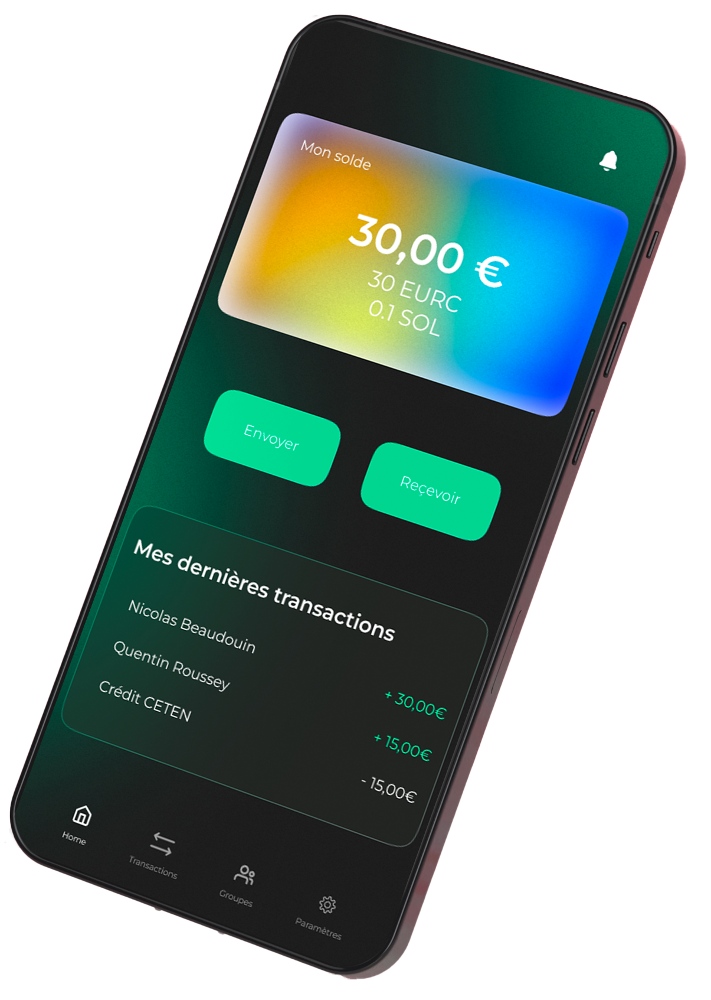
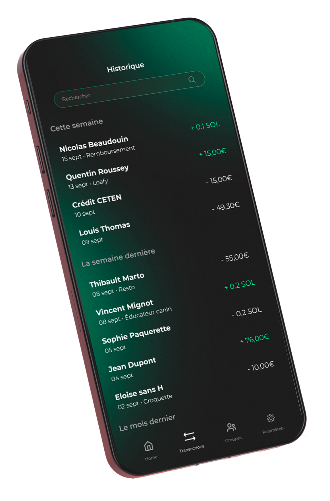

# User Friendly crypto wallet

This project will be transformed into a fully open-source project with focus on using Stellar Smart Wallet and a new version of the Solana smart contract.
This will be compatible with ledger hardware wallet.

- First integration of the "user-friendly and compliant" smart contract on solana (https://github.com/Nynko/solana_iteration3).
There will be another version of the smart contract focused on good account abstraction.
- The account abstraction part is partially implemented on stellar in this work : https://github.com/Nynko/StellarSecuredSmartWallet
and could be added to this wallet.

----


- Anoncreds V1 without revocations has been added with solana as a vdr : https://github.com/Nynko/solana-anoncreds-v1
- Kong is used as an API gateway to keep the API key safe
- For the external entity securing the funds the backend (for multisignature) is here : https://github.com/Nynko/backend_signatures
- For the issuer entity, the backend is here : https://github.com/Nynko/solana_anoncreds-backend_id

Everything is deployed using docker images and a docker compose file.


**Overall, still WIP, not fully clean, not always DRY.** But functional !

<p align="middle">


</p>

Figma Design by Heloise Suat.

# Getting Started

This is a new [**React Native**](https://reactnative.dev) project, bootstrapped using [`@react-native-community/cli`](https://github.com/react-native-community/cli).

> **Note**: Make sure you have completed the [React Native - Environment Setup](https://reactnative.dev/docs/environment-setup) instructions till "Creating a new application" step, before proceeding.

## Step 1: Start the Metro Server

First, you will need to start **Metro**, the JavaScript _bundler_ that ships _with_ React Native.

To start Metro, run the following command from the _root_ of your React Native project:

```bash
# using npm
npm start

# OR using Yarn
yarn start
```

## Step 2: Start your Application

Let Metro Bundler run in its _own_ terminal. Open a _new_ terminal from the _root_ of your React Native project. Run the following command to start your _Android_ or _iOS_ app:

### For Android

```bash
# using npm
npm run android

# OR using Yarn
yarn android
```

### For iOS

```bash
# using npm
npm run ios

# OR using Yarn
yarn ios
```

This is one way to run your app — you can also run it directly from within Android Studio and Xcode respectively.


- [React Native Website](https://reactnative.dev) - learn more about React Native.
- [Getting Started](https://reactnative.dev/docs/environment-setup) - an **overview** of React Native and how setup your environment.
- [Learn the Basics](https://reactnative.dev/docs/getting-started) - a **guided tour** of the React Native **basics**.
- [Blog](https://reactnative.dev/blog) - read the latest official React Native **Blog** posts.
- [`@facebook/react-native`](https://github.com/facebook/react-native) - the Open Source; GitHub **repository** for React Native.
